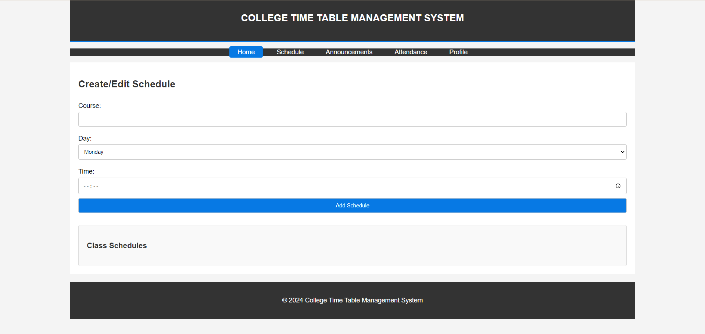

# College Time Table Management System

The College Time Table Management System aims to simplify the creation, modification, and sharing of class schedules for educational institutions.

## Preview

## Dive into the project

<em>(Tap on 🔗 icon to view the project)</em>

## Objective

The objective of this project is to provide an easy-to-use platform for educational institutions to manage class schedules efficiently. The system allows different user roles to interact with the schedules, ensuring smooth operations and better management of time.

## Key Features

1. **User Roles**: Define roles such as admin, faculty, and student with varying levels of access.
2. **Schedule Creation**: Provide a user-friendly interface for creating and editing class schedules.
3. **Automated Conflict Resolution**: Implement algorithms to automatically detect and resolve scheduling conflicts.
4. **User Calendar Integration**: Allow faculty and students to sync their schedules with personal calendar applications.
5. **Announcements**: Enable administrators and faculty to make important announcements related to class schedules.
6. **Attendance Tracking**: Integrate a system to track student attendance based on the class schedule.

## Tech Stack

- **HTML**: Structure the web page.
- **CSS**: Style the web page and ensure responsiveness.
- **JavaScript**: Add interactivity and handle logic for the application.

### Prerequisites

Make sure you have a web browser installed to view the HTML files.
